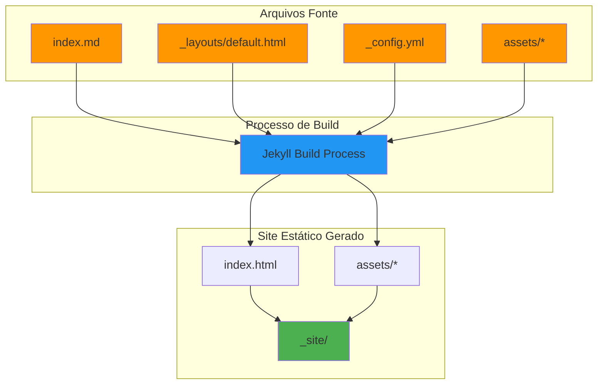

# 💪 V-Shape Plano Completo (Jekyll)

[](https://jekyllrb.com/)
[](https://pages.github.com/)
[](https://opensource.org/licenses/MIT)
[]()
[](https://github.com/leonardocs1000/SDD)

> Um site estático e responsivo construído com **Jekyll** para apresentar um plano de fitness e nutrição (V-Shape), otimizado para deploy no **GitHub Pages**.

---

## 📋 Sobre o Projeto

Este projeto está sendo desenvolvido em colaboração com uma IA, seguindo a metodologia **SDD (Specification-Driven Development)**, onde a documentação e as especificações orientam o processo de codificação.

### 🎯 Objetivo

Criar uma página web única, moderna e performática, demonstrando competência nas seguintes áreas:

- ✅ **Jekyll**: uso correto para geração de sites estáticos
- ✅ **Estrutura de Projeto**: organização de layouts, assets e conteúdo
- ✅ **HTML5 / CSS3 / JS**: design responsivo e interativo
- ✅ **GitHub Pages**: configuração e deploy contínuo
- ✅ **Colaboração IA**: README como memória do projeto (SDD)

---

## 🏗️ Arquitetura do Projeto (Jekyll)

A arquitetura de um site Jekyll é baseada em um processo de build que transforma arquivos de texto e assets em um site estático completo.



### Componentes

| Componente | Descrição |
|---|---|
| Arquivos Fonte | Markdown/HTML, layouts, configuração e assets (CSS, JS). |
| Jekyll Build | Processa arquivos, aplica layouts e gera HTML estático. |
| Site Estático | Output em `_site/`, pronto para ser servido com HTML, CSS e JS. |

---

## 🔧 Stack

- **Core**: Jekyll `~> 4.3.0`, Ruby `3.0+`, Bundler
- **Frontend**: HTML5, CSS3 (`assets/css/v-shape.css`), JS (`assets/js/v-shape.js`)
- **Infra**: GitHub Pages (deploy), GitHub Actions (implementado)

---

## 📁 Estrutura

```text
v-shape-jekyll-site/
│
├── .github/
│   └── workflows/
│       └── deploy.yml          # 🚀 CI/CD para GitHub Pages
│
├── _layouts/
│   └── default.html            # 📐 Layout principal
│
├── assets/
│   ├── css/
│   │   └── v-shape.css         # 🎨 Estilos
│   └── js/
│       └── v-shape.js          # ⚙️ Navegação/Interação
│
├── _config.yml                 # 🔧 Config Jekyll
├── Gemfile                     # 💎 Dependências Ruby
├── favicon.svg                 # 🔖 Favicon vetorial
├── index.md                    # 📝 Página principal (Markdown/HTML)
├── oldindex.html               # 🗂️ Versão antiga de referência
├── README.md                   # 🧠 Documento atual (memória do projeto)
└── .gitignore
```

---

## 🚀 Quick Start

### 🪟 Windows (RubyInstaller)

#### 1. Instalar Ruby + DevKit

Baixe o Ruby + DevKit em `rubyinstaller.org`.
Recomendação: Ruby+DevKit `3.1.x` ou `3.2.x`.

Durante a instalação:
- marque **Add Ruby executables to your PATH**
- ao final, rode `ridk install` e instale o **MSYS2/DevKit** (opção 1)

#### 2. Abrir um novo PowerShell e verificar

```bash
ruby -v
gem -v
ridk version
```

#### 3. Instalar o Bundler

```bash
gem install bundler
bundler -v
```

#### 4. Instalar as dependências do projeto

```bash
cd caminho\para\seu\projeto
bundle install
```

#### 5. Subir o servidor local

```bash
bundle exec jekyll serve --livereload
```

Acesse: `http://localhost:4000`

Se `bundle` ainda não for reconhecido, feche e reabra o terminal ou reinicie o PC.

### 🐧 WSL (Ubuntu)

```bash
sudo apt update
sudo apt install -y ruby-full build-essential zlib1g-dev
gem install bundler jekyll
bundle install
bundle exec jekyll serve
```

### 🐳 Docker

```bash
docker run --rm -it -p 4000:4000 -v ${PWD}:/srv/jekyll jekyll/jekyll:4.3 jekyll serve
```

---

## 🎯 Roadmap

### ✅ Fase 1: Setup (Concluído)

- [x] `_config.yml` básico
- [x] `Gemfile` com Jekyll e plugins
- [x] Estrutura `assets` e `_layouts`
- [x] `index.html` original e `oldindex.html`
- [x] `README.md` inicial

### ✅ Fase 2: Conteúdo & Layout (Concluído)

- [x] Refatorar `index.md` para usar estrutura compatível com CSS/JS
- [x] Adicionar favicon (`favicon.svg`)
- [x] Garantir responsividade e acessibilidade

### 🚧 Fase 3: Deploy & Otimização (Em andamento)

- [x] Configurar GitHub Pages
- [x] Criar workflow em `.github/workflows/deploy.yml`
- [ ] Otimizar assets e validar com Lighthouse

---

## 📐 Metodologia SDD

Fluxo de desenvolvimento orientado por especificação:


### Comandos usuais

```text
INIT: /sdd:spec-init "Descrição da feature"
REQUIREMENTS: /sdd:spec-requirements
IMPLEMENT: /sdd:spec-impl
VALIDATE: /sdd:validate-impl
```

---

## 📄 Licença

MIT. Consulte `LICENSE`.